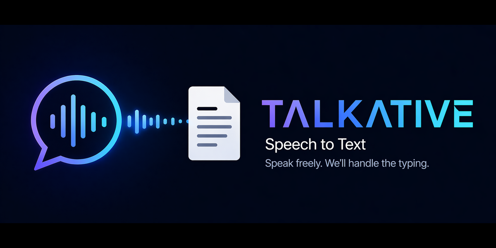

<p align="center">
  
</p>

# TALKATIVE

TALKATIVE is a free, local speech-to-text tool that types out what you say.

## Features
- **Local AI**: Uses `faster-whisper` for local transcription. There are no paid speech APIs or per-use costs.
- **Global Hotkey**: Press `CTRL + ALT` to start and stop recording from any application.
- **System Tray Integration**: Visual feedback via a tray icon:
  - **Gray**: Idle
  - **Red**: Recording
  - **Yellow**: Processing
- **Instant Typing**: Automatically types the transcribed text into your active window.

## Active Languages
- **English (`en`)**: Currently active by default through the `base.en` Whisper model.

Other languages are not enabled by default in the current setup.

## Setup
Create the virtual environment and install dependencies:

```powershell
python -m venv venv
.\venv\Scripts\python.exe -m pip install -r requirements.txt
```

## How to Start
Simply double-click **Start_TALKATIVE.vbs**. 
This will launch the application in the background without opening a terminal window.

## Changing the Hotkey
If you want to use a different hotkey, open `main.py` in a text editor and change the string in this line:
`keyboard.add_hotkey('ctrl+alt', self.on_hotkey)`

## Troubleshooting
- **First Run**: The first time you use it, it will download the Whisper AI model (approx 150MB). The icon will stay yellow for a bit.
- **Offline Use**: After the model is downloaded, TALKATIVE loads it from your local Hugging Face cache.
- **Microphone**: Ensure your default system microphone is set correctly in Windows settings.
- **Permissions**: If the hotkey doesn't work, try running the application (or your terminal) as an Administrator.
- **Logs**: `talkative.log` is local-only and ignored by Git. It records runtime status, not full transcript text.
